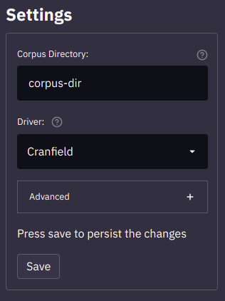
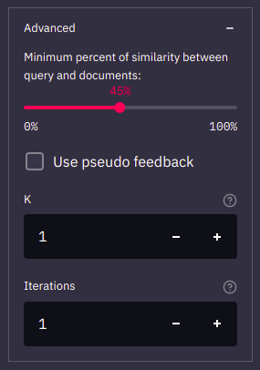
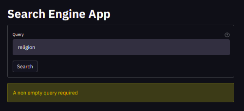

# Search-Engine

This project is an implementation of a Search Engine capable of proccess an index a documents corpus
in order to make search queries over its contents

## Install ⚙️
The project was developed using `python 3.7.4`. If you need to install python see the official site [python.org](https://www.python.org/downloads).

Additionally for use the project visual interface you will need to install the project dependencies using:
```bash
make install
```

## Execution ▶️
We have 3 different entry points

### Cmd execution
```bash
python main.py cmd -c <corpus-dir> -d <driver> -q <query>
```
The previous command load the corpus at `<corpus-dir>` in order to find the relevant documents for the query `<query>`. Additionally is necessary to specify which driver `<driver>` use to parse the corpus.

> Note there 3 drivers implemented, Cranfield, Reuters and NewsGroup. Feel free to add new parsers.

### Evaluation of results
```bash
python main.py eval -c <corpus-dir> -d <driver> -p <param1> <param2> ...
```
The previous command use the corpus at `<corpus-dir>` to test the results of the search-engine given set of queries and the group of relevant files for every one of them. 

Using the argument `-p` you are free to pass any number of `<params>` needed by the driver `<driver>` in order to parse the test suite.

> Only the Cranfield driver has an implementation for read a test suit. This implementation receive 2 parameters, the first is the directory of the queries, and the second the directory of the queries answers.

### Visual application
> **Streamlit** required

To start the application just type:
```
streamlit run main.py visual
```
or use the makefile rule `run`:
```
make run
```
### Help
In order to explore all the arguments available in each execution mode just type:
```
python main.py <mode> -h
```
> Replace `<mode>` for cmd, eval or visual

## App usage 📋
In the app sidebar you have the settings section:



You need to introduce a Corpus directory or file and the appropiate Driver from the select list.

Optionally you can expand the Advanced settings:



Here you can configure some other params, like the similarity percent and the pseudo feedback

> Read the inputs description at the `?` symbol for more information.

Once you save your initial configuration, you are ready to make queries in the system.

> You can change and save the settings as many times as you want.



Write the query, press search, and see your results.


You can select the relevant document making some of them like in the picture above, and the subimt your feedback pressing the button at the end of the page (see the image below). Doing this you are helping to improve the search results.


## Drivers

Drivers are ment for loading corpus documents. If you have a new corpus format
you need to add a custom driver.

### Implementation

Drivers are clases with an static method that recieve the directory address of the 
corpus as argument.

Optionally you can add a method `queries` with arguments that you need for loading
the test suite to test a corpus.

```python
class YourDriverName:
    @staticmethod
    def read(addr):
        # your code here

    @staticmethod
    def queries(param1, param2, ....):
        # your code here
```

The `read` method return a list of documents with the following format:

```python
{
    "id": "<docId>",
    "title": "<docTitle>",
    "author": "<docAuthor>",
    "text": "<docText>",
}
```

The `queries` method return a list of query test with the following format:

```python
{
    "id": "<TestId>",
    "query": "<TestQuery>", 
    "rel": "[<doc1>, <doc2>, ...]",
}
```
Where `rel` is a list of relevant documents for the query.

### Registration

Add your driver to the folder `src/corpustools/drivers/`.

To register your driver edit the `src/corpustools/drivers/__init__.py` like showed below

```python
# some imports ...
from .yourdriverfile import YourDriver

drivers = [
    # other registered drivers ...
    YourDriver,
]

...
```
